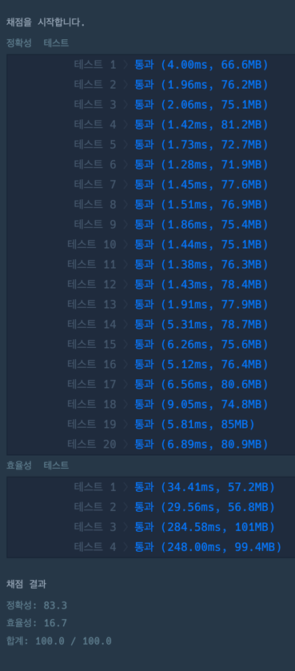
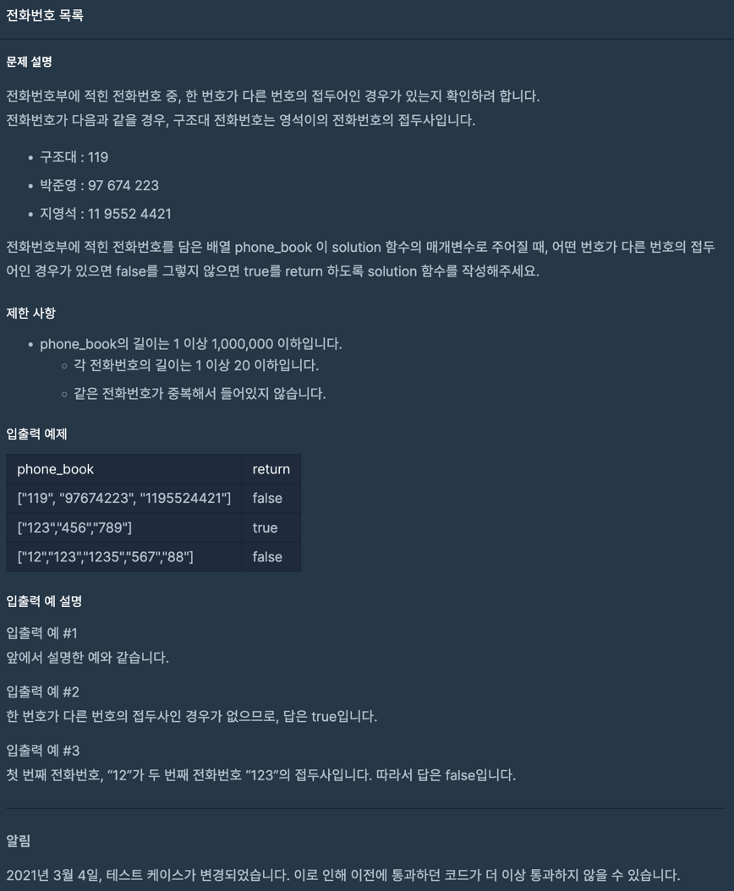

~~~java
import java.util.*;
import java.util.stream.Collectors;

class Solution {

    /**
     * 최종
     *
     * 정렬 후 다음 것만 비교
     * (정렬시 문자열이라 앞 숫자가 작은것부터 정렬됨)
     * ex)
     * {"119", "97674223", "1195524421"} -> 119, 1195524421, 97674223
     *
     * @param phone_book
     * @return
     */
    public boolean solution(String[] phone_book) {
        List<String> sorted = Arrays.stream(phone_book)
                .sorted()
                .collect(Collectors.toList());

        final var size = sorted.size();

        for (int currentIndex = 0, i = 1; i < size; i++) {
            String current = sorted.get(currentIndex);
            String next = sorted.get(i);

            if (next.indexOf(current) == 0) return false;

            currentIndex++;
        }

        return true;
    }
}
~~~