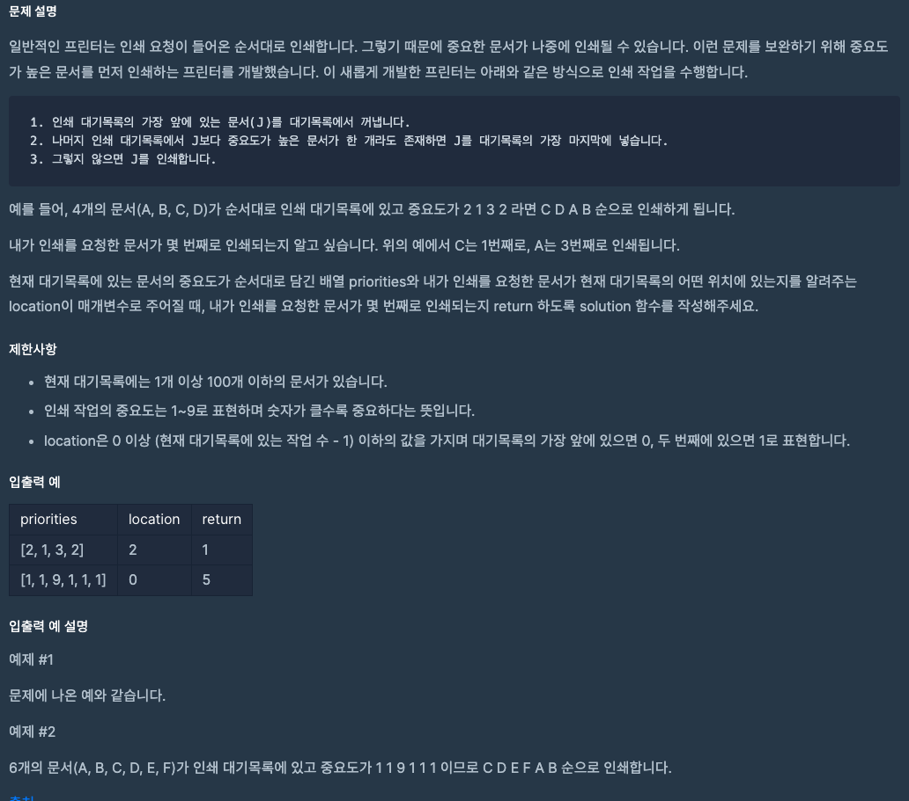
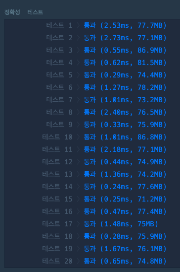

# programers_42587_프린터
##### https://school.programmers.co.kr/learn/courses/30/lessons/42587

## 문제 설명
> 
---
### 실행결과

---
### 최종 풀이 - TRY 1
~~~java
import java.util.*;

class Solution {
    public int solution(int[] priorities, int location) {
        int answer = 1;
        List<Node> arrayList = new ArrayList<>();

        for (int i = 0; i < priorities.length; i++) {
            final var node = new Node(i, priorities[i]);

            arrayList.add(node);
        }

        for (int i = 0, j = 1; j < arrayList.size(); j++) {
            Node currentNode = arrayList.get(i);
            Node nextNode = arrayList.get(j);

            if (currentNode.value < nextNode.value) {
                List<Node> preIndex = arrayList.subList(i, j);

                arrayList = arrayList.subList(j, arrayList.size());
                arrayList.addAll(preIndex);

                j = 0;
            }

            if (j + 1 == arrayList.size()) {
                final var node = arrayList.get(0);

                if (node.index == location) break;

                arrayList.remove(0);
                answer++;
                j = 0;
            }
        }
        return answer;
    }

    class Node {
        int index;
        int value;

        public Node(int index, int value) {
            this.index = index;
            this.value = value;
        }
    }
}
~~~
---
### TRY 1
- 성공
~~~java
import java.util.*;

class Solution {
    public int solution(int[] priorities, int location) {
        int answer = 1;
        List<Node> arrayList = new ArrayList<>();

        for (int i = 0; i < priorities.length; i++) {
            final var node = new Node(i, priorities[i]);

            arrayList.add(node);
        }

        for (int i = 0, j = 1; j < arrayList.size(); j++) {
            Node currentNode = arrayList.get(i);
            Node nextNode = arrayList.get(j);

            if (currentNode.value < nextNode.value) {
                List<Node> preIndex = arrayList.subList(i, j);

                arrayList = arrayList.subList(j, arrayList.size());
                arrayList.addAll(preIndex);

                j = 0;
            }

            if (j + 1 == arrayList.size()) {
                final var node = arrayList.get(0);

                if (node.index == location) break;

                arrayList.remove(0);
                answer++;
                j = 0;
            }
        }
        return answer;
    }

    class Node {
        int index;
        int value;

        public Node(int index, int value) {
            this.index = index;
            this.value = value;
        }
    }
}
~~~
---
### 다른 사람의 풀이
~~~java
import java.util.*;

class Solution {
    public int solution(int[] priorities, int location) {
        int answer = 0;
        int l = location;

        Queue<Integer> que = new LinkedList<Integer>();
        for(int i : priorities){
            que.add(i);
        }

        Arrays.sort(priorities);
        int size = priorities.length-1;

        while(!que.isEmpty()){
            Integer i = que.poll();
            if(i == priorities[size - answer]){
                answer++;
                l--;
                if(l <0)
                    break;
            }else{
                que.add(i);
                l--;
                if(l<0)
                    l=que.size()-1;
            }
        }

        return answer;
    }
}
~~~
~~~java
import java.util.ArrayList;
import java.util.List;

class Solution {
    public int solution(int[] priorities, int location) {
        List<Integer> list = new ArrayList<>();
        for (int priority : priorities) {
            list.add(priority);
        }

        int turn = 1;
        while (!list.isEmpty()) {
            final Integer j = list.get(0);
            if (list.stream().anyMatch(v -> j < v)) {
                list.add(list.remove(0));
            } else {
                if (location == 0) {
                    return turn;
                }
                list.remove(0);
                turn++;
            }

            if (location > 0) {
                location--;
            } else {
                location = list.size() - 1;
            }
        }

        throw new IllegalArgumentException();
    }
}
~~~
