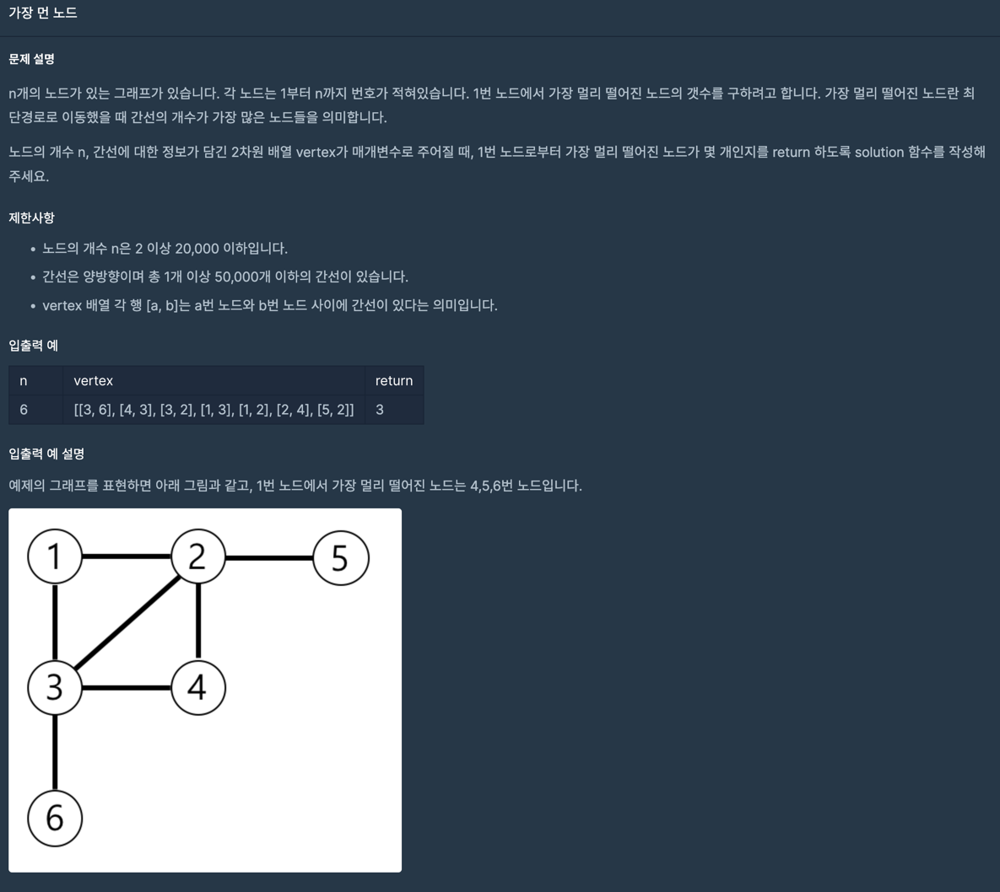
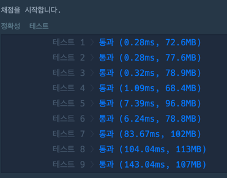

# programers_49189 가장먼노드
##### https://school.programmers.co.kr/learn/courses/30/lessons/49189?language=java

## 문제 설명
> 

---

### 실행결과

---

### 최종 풀이 - TRY 1 

~~~java
import java.util.*;

class Solution {
    public int solution(int[] priorities, int location) {
        int answer = 1;
        List<Node> arrayList = new ArrayList<>();

        for (int i = 0; i < priorities.length; i++) {
            final var node = new Node(i, priorities[i]);

            arrayList.add(node);
        }

        for (int i = 0, j = 1; j < arrayList.size(); j++) {
            Node currentNode = arrayList.get(i);
            Node nextNode = arrayList.get(j);

            if (currentNode.value < nextNode.value) {
                List<Node> preIndex = arrayList.subList(i, j);

                arrayList = arrayList.subList(j, arrayList.size());
                arrayList.addAll(preIndex);

                j = 0;
            }

            if (j + 1 == arrayList.size()) {
                final var node = arrayList.get(0);

                if (node.index == location) break;

                arrayList.remove(0);
                answer++;
                j = 0;
            }
        }
        return answer;
    }

    class Node {
        int index;
        int value;

        public Node(int index, int value) {
            this.index = index;
            this.value = value;
        }
    }
}
~~~
